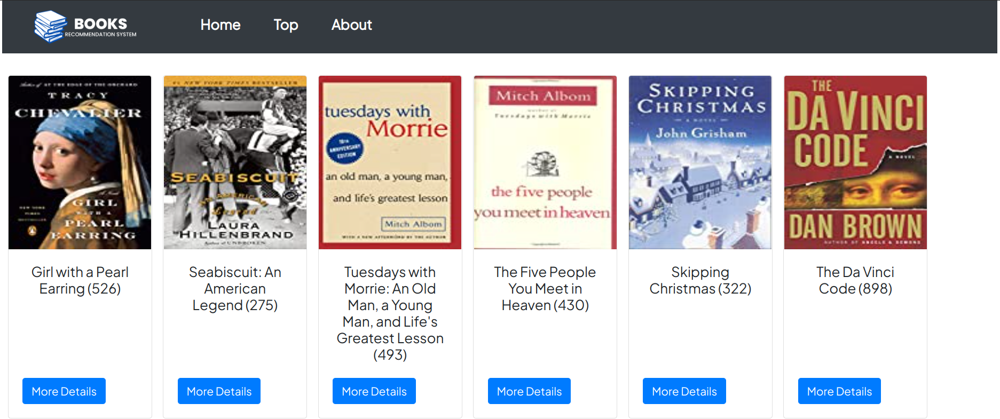
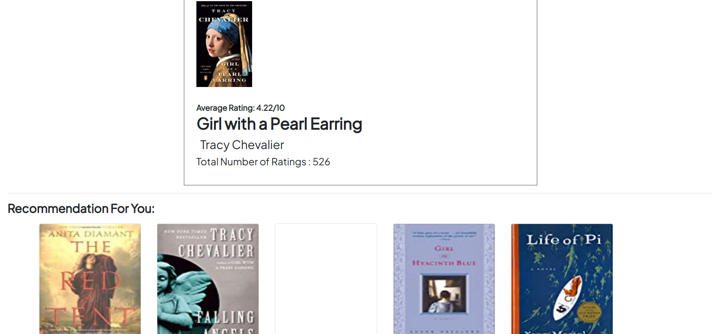
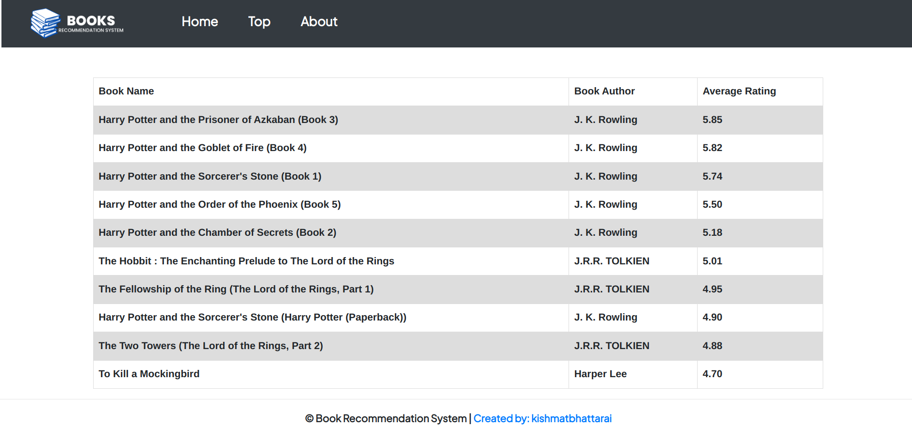

  
 
<b>

Book Recommendation System is the website with collections of top readed books with the functionaliy of recommendation system. It basically recommends the book on the basis of given books. It also shows data of different books available.
 

<h2>Features Included:</h2>
    
- Popularity Based Recommendation
- Content Based Recommendation
- Basic Books Details
     
     
    
<h2>Tools Used:</h2>
    
- Flask
- Pandas
- Numpy
- Pickle 
- HTML & CSS
  

<h2>Snapshots:</h2>
  
  
  
